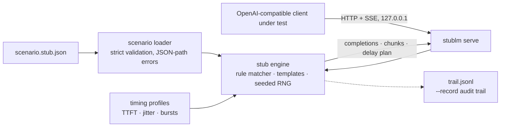

# stublm

[English](README.md) | [中文](README.zh.md) | [日本語](README.ja.md)

[](LICENSE)   [](CONTRIBUTING.md)

**オープンソースの決定論的 OpenAI 互換スタブサーバー — 1 つの JSON ファイルでスクリプト化した応答・シード可能なストリーム・リアルな SSE チャンクタイミングを定義し、フロントエンドと SDK のテストをオフライン・キー不要・毎回バイト単位で同一に。**


```bash
# not yet on npm — install from a checkout of this repository
npm install && npm run build && npm pack
npm install -g ./stublm-0.1.0.tgz
```

## なぜ stublm？

chat-completions API と会話するもの — ストリーミング UI、SDK のリトライループ、agent フレームワーク — をテストするには相手側にサーバーが必要で、実エンドポイントは API キー、ネットワークの揺らぎ、課金、実行のたびに変わる回答を持ち込みます。よくある回避策にはそれぞれ穴があります：手書きの HTTP モックは JSON は偽装しても*ストリーミング*はほぼ偽装せず、SSE 描画パスは未テストのまま出荷される；record/replay カセットは録画のために動く有料 API が必要で、再生時のチャンクにリアルなペースがない；小さな実モデルをローカルで動かすのは遅く非決定的で、誰も望まない CI 依存になる。stublm はスクリプト路線を取ります：1 つの JSON シナリオがサーバー全体を宣言 — 最後の user メッセージ・モデル・宣言されたツールでルールをマッチ；スクリプト化した tool call（わざと壊した引数も含む）；2 回失敗して回復する `times` 予算；TTFT・チャンク間遅延・シード付きジッター・バーストを形づくるタイミングプロファイル。同じシナリオ、同じリクエスト列、同じバイト — そして `instant` プロファイルはストリーム全体を同期で吐くので、CI は決して sleep しません。

|  | stublm | 手書きモック（nock/msw） | record/replay カセット | ローカルモデルランナー |
|---|---|---|---|---|
| フィクスチャの源 | 宣言的な JSON シナリオ | JS インターセプタコード | 採取した実トラフィック | 実モデル |
| リアルなペースの SSE ストリーム | プロファイル：TTFT・ジッター・バースト | ほぼ偽装されない | 再生はするがタイミングなし | 実物だが制御不能 |
| 実行間の決定性 | seed ごとにバイト同一 | あり（手作業で維持） | あり、ただし陳腐化しがち | なし |
| スクリプト化エラーとリトライ列 | JSON の `times` + `error` ルール | テストごとに手書き | 録画できた場合のみ | スクリプト化不可 |
| 実 API やキーの要否 | 不要 | 不要 | 録画時に必要 | 不要だが GB 級の重み + GPU |
| ランタイムの重さ | Node、依存 0 | テストランナー + ライブラリ | プロキシ + カセット保管 | モデル重み + ランタイム |

<sub>能力の比較は各方式の公開ドキュメントに照らして確認、2026-07。録画した *agent のツール呼び出し* を再生するなら agent-vcr を — stublm は合成サーバー挙動をスクリプト化する側です。</sub>

## 特徴

- **シナリオ駆動、録画ではない** — 偽サーバー全体がレビュー可能な 1 つの JSON ファイル；`stublm validate` は誤字・死にルール・壊れた正規表現・テンプレートミスを、CI が走る前に正確な JSON パス付きで拒否します。
- **バイト単位で決定的** — 応答・id・embedding・ストリームのジッターまでリクエストの seed（または内容ハッシュ）から導出；唯一の「時計」はセッションごとの呼び出しカウンタなので、flaky テスト狩りがここに辿り着くことはありません。
- **リアルな SSE タイミングプロファイル** — `steady`・`typewriter`・`bursty` と自作：TTFT、チャンク間遅延、シード付きジッター、バースト＋休止の形；組み込み `instant` は同期でストリームしテストは決して sleep せず、`--show-timing` は待たずに計画を印字します。
- **スクリプト化された失敗シーケンス** — `times` 予算と `error` ペイロードで「`Retry-After: 1` 付きの 429 を 1 回、その後成功」を JSON 5 行で表現：リトライとバックオフのロジックについに試験台ができました。
- **忠実にストリームされる tool call** — スクリプト化した `tool_calls` は実 API と同じくヘッダ + 引数断片の delta として流れ、文字列引数はそのまま素通しなので、壊れた JSON に対するクライアントの挙動をテストできます。
- **本物の API 表面** — `/v1/chat/completions`（JSON + SSE）、`/v1/models`、`/v1/embeddings`、`/healthz`、Bearer 認証、CORS、usage 集計、`max_tokens` 切り詰め、`n` choice；任意の OpenAI 互換 SDK を `http://127.0.0.1:<port>/v1` に向けるだけ。
- **ランタイム依存ゼロ、完全オフライン** — 必要なのは Node.js だけ；stublm は 127.0.0.1 のみにバインドし、どこにも何も送らず、devDependency は `typescript` ただ 1 つです。

## クイックスタート

インストール：

```bash
# not yet on npm — install from a checkout of this repository
npm install && npm run build && npm pack
npm install -g ./stublm-0.1.0.tgz
```

同梱のサポートボットシナリオを眺めてから、スクリプト化された失敗シーケンスを再生します（実際に採取した実行結果）：

```bash
stublm inspect --scenario examples/support.stub.json
```

```text
support-stub v1.2.3 — 4 rule(s), 2 model(s), default profile "instant"
models: stub-large, stub-mini

#  LABEL            WHEN                                 TIMES  RESULT     PROFILE
0  refund-policy    lastUser has "refund"                -      text       -
1  escalation       lastUser /\b(manager|supervisor|h…/  -      text       -
2  rate-limit-once  lastUser has "flaky"                 1      error 429  -
3  watch-it-render  model=stub-mini, stream=true         -      text       slow-net

fallback: generate (2 sentence(s))
```

```bash
stublm reply --scenario examples/support.stub.json --message "this is flaky" --repeat 2
```

```text
{"status":429,"error":{"message":"Rate limit reached (scripted; the retry will succeed)","type":"rate_limit_error","param":null,"code":"rate_limit_exceeded"}}
The dataset organizes the remaining edge cases. Each component summarizes the remaining edge cases with minimal configuration.
```

次に HTTP で立ち上げ、本物と同じように叩きます（実際に採取した実行結果）：

```bash
stublm serve --scenario examples/support.stub.json --port 8437 --quiet &
curl -s http://127.0.0.1:8437/v1/chat/completions -H 'content-type: application/json' \
  -d '{"model":"stub-large","messages":[{"role":"user","content":"Can I get a refund?"}],"seed":7}'
```

```text
[stublm] serving "support-stub" v1.2.3 on http://127.0.0.1:8437 — 4 rule(s), 2 model(s), default profile "instant"
{"id":"chatcmpl-37a3176fd2e5713b6a2545af","object":"chat.completion","created":1735689600,"model":"stub-large","system_fingerprint":"fp_763f228f","choices":[{"index":0,"message":{"role":"assistant","content":"Refunds are processed within 5 business days. You asked: Can I get a refund?"},"logprobs":null,"finish_reason":"stop"}],"usage":{"prompt_tokens":13,"completion_tokens":22,"total_tokens":35}}
```

ストリーミングリクエストはルールのタイミングプロファイルに従って SSE チャンクを受け取ります；`x-stublm-profile: instant` ヘッダを付ければ CI 用にどのプロファイルも遅延ゼロに畳めます。`stublm init` は注釈付きのスターターシナリオを書き出します；詳しくは [examples/](examples/README.md) へ。

## シナリオファイル

1 つの JSON ファイルがサーバー全体を宣言します。ルールは順に試され、`when` がマッチし `times` 予算が残っている最初のものが採用されます。完全なリファレンスは [docs/scenario-format.md](docs/scenario-format.md) に。

| ルールキー | デフォルト | 効果 |
|---|---|---|
| `when` | 全マッチ | `model`（完全一致か `stub-*` グロブ）、`lastUser`/`system` テキストマッチャ（`equals`/`contains`/`regex`）、`hasTool`、`stream` |
| `times` | 無制限 | 最大 N 回だけ提供し、以後は素通り — シーケンスと一時故障 |
| `reply` | — | `{{message}}`/`{{call}}`/`{{seed}}` テンプレート付きテキスト、および/または `toolCalls`（文字列引数はそのまま、壊れていても素通し） |
| `error` | — | `status`・`message`・`code`・`retryAfterSeconds` → `Retry-After` 付きの本物の HTTP エラー |
| `profile` | シナリオ既定 | このルールのストリームに使うタイミングプロファイル |

挙動スイッチ：`strictModels`（未知モデルは 404）、`clock: "fixed"`（`created` を凍結してバイト同一を保証）、`embeddingDims`、`cors`、`server.apiKey`（Bearer 認証）。未マッチのリクエストは `fallback` へ：シード付き `generate` の文章、`echo`、または厳格な `reject` 404。

## `stublm` CLI

| コマンド | 役割 | 終了コード |
|---|---|---|
| `init [path]` | 注釈付きスターターシナリオを書き出す | 0、既存なら 2（`--force` で上書き） |
| `validate --scenario f` | シナリオをオフライン検査、JSON パス付きエラー、死にルールは警告 | 0 / 1 不正 / 2 読めない |
| `inspect --scenario f` | ルール・モデル・プロファイルの表（`--format json`） | 0 |
| `reply --message t` | chat 呼び出しをプロセス内で 1 回実行；`--stream`・`--show-timing`・`--seed`・`--repeat N` | 0、エラー応答があれば 1 |
| `serve --scenario f` | 127.0.0.1 上の HTTP サーバー；`--port`（0 = 空きポート）、`--record f.jsonl`、`--quiet`（リクエスト毎ログなし） | 0 |

## アーキテクチャ



## ロードマップ

- [x] シナリオ駆動の OpenAI 互換スタブ：マッチ/シーケンス/テンプレート応答、ストリームされる tool call、シード付きタイミングプロファイル、embeddings、Bearer 認証、`--record`、そして `init`/`validate`/`inspect`/`reply`/`serve` CLI（v0.1.0）
- [ ] 明示オプトインのカオス機能：ストリーム途中の切断、SSE フレームの切り詰め、永久ストール — タイムアウト経路のテスト用
- [ ] `/v1/responses` とレガシー `/v1/completions` エンドポイントのエミュレーション
- [ ] アサーションヘルパー：`stublm verify trail.jsonl --expect expectations.json`
- [ ] マルチターン会話のスクリプト化（assistant 履歴をキーにしたルール）
- [ ] npm への公開

全リストは [open issues](https://github.com/JaydenCJ/stublm/issues) を参照。

## コントリビュート

コントリビュート歓迎です。`npm install && npm run build` でビルドし、`npm test`（89 テスト）と `bash scripts/smoke.sh`（`SMOKE OK` の出力が必須）を実行してください — このリポジトリは CI を持たず、上記の主張はすべてローカル実行で検証されています。[CONTRIBUTING.md](CONTRIBUTING.md) を読み、[good first issue](https://github.com/JaydenCJ/stublm/issues?q=is%3Aissue+is%3Aopen+label%3A%22good+first+issue%22) を掴むか、[discussion](https://github.com/JaydenCJ/stublm/discussions) を始めてください。

## ライセンス

[MIT](LICENSE)
