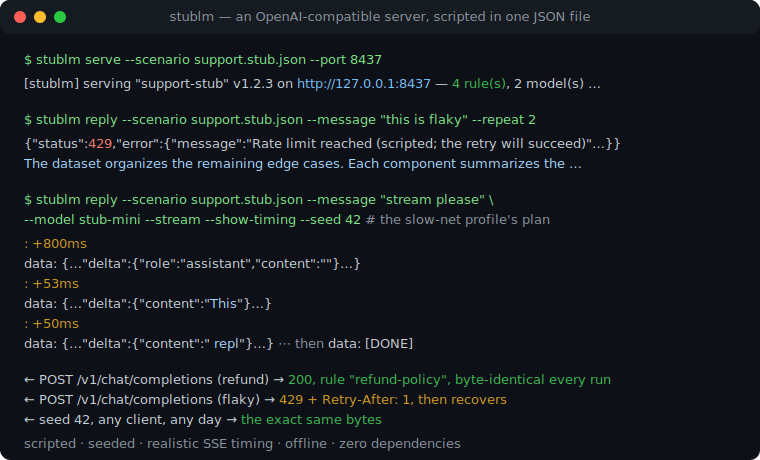
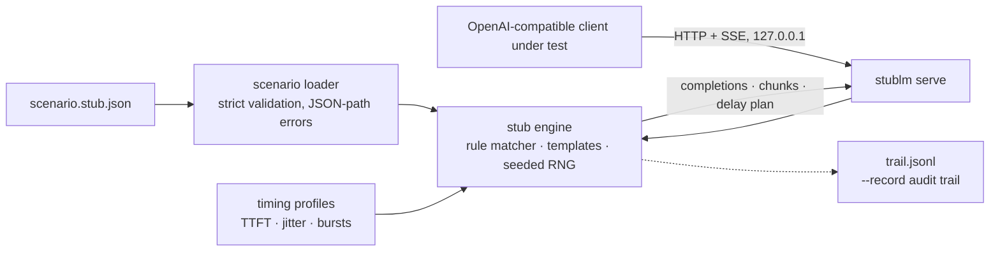

# stublm

[English](README.md) | [中文](README.zh.md) | [日本語](README.ja.md)

[](LICENSE)   [](CONTRIBUTING.md)

**An open-source deterministic OpenAI-compatible stub server — scripted replies, seeded streams and realistic SSE chunk timing from one JSON file, so frontend and SDK tests run offline, without keys, byte-identical every time.**



```bash
# not yet on npm — install from a checkout of this repository
npm install && npm run build && npm pack
npm install -g ./stublm-0.1.0.tgz
```

## Why stublm?

Testing anything that talks to a chat-completions API — a streaming UI, an SDK retry loop, an agent framework — needs a server on the other side, and every real endpoint drags in API keys, network flakiness, money, and answers that change between runs. The usual workarounds each miss the mark: hand-rolled HTTP mocks stub the JSON but almost never fake *streaming*, so the SSE render path ships untested; record/replay cassettes need a working paid API to record from and replay chunks with no realistic pacing; running a small real model locally is slow, non-deterministic, and a CI dependency nobody wants. stublm takes the scripted path instead: one JSON scenario declares the server — rules matched on the last user message, model or declared tools; scripted tool calls (including deliberately malformed arguments); `times` budgets that fail twice then recover; timing profiles that shape TTFT, inter-chunk delay, seeded jitter and bursts. Same scenario, same request sequence, same bytes — and the `instant` profile streams everything synchronously, so CI never sleeps.

|  | stublm | hand-rolled mock (nock/msw) | record/replay cassettes | local model runner |
|---|---|---|---|---|
| Fixture source | declarative JSON scenario | JS interceptor code | captured real traffic | a real model |
| Streaming SSE with realistic pacing | profiles: TTFT, jitter, bursts | rarely faked at all | replayed without timing | real but uncontrollable |
| Deterministic across runs | byte-identical per seed | yes (hand-maintained) | yes, but stale-prone | no |
| Scripted errors & retry sequences | `times` + `error` rules in JSON | hand-coded per test | only if captured live | cannot be scripted |
| Needs a real API or keys | never | no | yes, to record | no, but needs GBs + GPU |
| Runtime footprint | Node, 0 dependencies | your test runner + lib | proxy + cassette store | model weights + runtime |

<sub>Capability claims checked against each approach's public documentation, 2026-07. For replaying recorded *agent tool calls*, see agent-vcr — stublm scripts synthetic server behavior instead.</sub>

## Features

- **Scenario-driven, not recorded** — the whole fake server lives in one reviewable JSON file; `stublm validate` rejects typos, dead rules, bad regexes and template mistakes with exact JSON paths before CI ever runs.
- **Deterministic to the byte** — replies, ids, embeddings and even stream jitter derive from the request seed (or a content hash); the only "clock" is a per-session call counter, so flaky-test hunting never leads here.
- **Realistic SSE timing profiles** — `steady`, `typewriter`, `bursty` and your own: TTFT, inter-chunk delay, seeded jitter, burst-then-pause shapes; the `instant` built-in streams synchronously so tests never sleep, and `--show-timing` prints the plan without waiting for it.
- **Scripted failure sequences** — `times` budgets plus `error` payloads express "429 with `Retry-After: 1` once, then succeed" in five lines of JSON: retry and backoff logic finally gets a test bench.
- **Tool calls, faithfully streamed** — scripted `tool_calls` stream as header + argument-fragment deltas exactly like the real API, and string arguments pass through verbatim so you can test clients against malformed JSON.
- **A real API surface** — `/v1/chat/completions` (JSON + SSE), `/v1/models`, `/v1/embeddings`, `/healthz`, Bearer auth, CORS, usage accounting, `max_tokens` truncation, `n` choices; point any OpenAI-compatible SDK at `http://127.0.0.1:<port>/v1`.
- **Zero runtime dependencies, fully offline** — Node.js is the only requirement; stublm binds 127.0.0.1 only, sends nothing anywhere, and `typescript` is the sole devDependency.

## Quickstart

Install:

```bash
# not yet on npm — install from a checkout of this repository
npm install && npm run build && npm pack
npm install -g ./stublm-0.1.0.tgz
```

Look at the bundled support-bot scenario, then play a scripted failure sequence (real captured runs):

```bash
stublm inspect --scenario examples/support.stub.json
```

```text
support-stub v1.2.3 — 4 rule(s), 2 model(s), default profile "instant"
models: stub-large, stub-mini

#  LABEL            WHEN                                 TIMES  RESULT     PROFILE
0  refund-policy    lastUser has "refund"                -      text       -
1  escalation       lastUser /\b(manager|supervisor|h…/  -      text       -
2  rate-limit-once  lastUser has "flaky"                 1      error 429  -
3  watch-it-render  model=stub-mini, stream=true         -      text       slow-net

fallback: generate (2 sentence(s))
```

```bash
stublm reply --scenario examples/support.stub.json --message "this is flaky" --repeat 2
```

```text
{"status":429,"error":{"message":"Rate limit reached (scripted; the retry will succeed)","type":"rate_limit_error","param":null,"code":"rate_limit_exceeded"}}
The dataset organizes the remaining edge cases. Each component summarizes the remaining edge cases with minimal configuration.
```

Now serve it over HTTP and hit it like the real thing (real captured run):

```bash
stublm serve --scenario examples/support.stub.json --port 8437 --quiet &
curl -s http://127.0.0.1:8437/v1/chat/completions -H 'content-type: application/json' \
  -d '{"model":"stub-large","messages":[{"role":"user","content":"Can I get a refund?"}],"seed":7}'
```

```text
[stublm] serving "support-stub" v1.2.3 on http://127.0.0.1:8437 — 4 rule(s), 2 model(s), default profile "instant"
{"id":"chatcmpl-37a3176fd2e5713b6a2545af","object":"chat.completion","created":1735689600,"model":"stub-large","system_fingerprint":"fp_763f228f","choices":[{"index":0,"message":{"role":"assistant","content":"Refunds are processed within 5 business days. You asked: Can I get a refund?"},"logprobs":null,"finish_reason":"stop"}],"usage":{"prompt_tokens":13,"completion_tokens":22,"total_tokens":35}}
```

Streaming requests get SSE chunks paced by the rule's timing profile; add the `x-stublm-profile: instant` header to collapse any profile to zero for CI. `stublm init` writes an annotated starter scenario; more in [examples/](examples/README.md).

## The scenario file

One JSON file declares the whole server. Rules are tried in order; the first whose `when` matches and whose `times` budget survives is served. Full reference in [docs/scenario-format.md](docs/scenario-format.md).

| Rule key | Default | Effect |
|---|---|---|
| `when` | match all | `model` (exact or `stub-*` glob), `lastUser`/`system` text matchers (`equals`/`contains`/`regex`), `hasTool`, `stream` |
| `times` | unlimited | serve at most N times, then fall through — sequences and transient failures |
| `reply` | — | text with `{{message}}`/`{{call}}`/`{{seed}}` templates, and/or `toolCalls` (string arguments pass verbatim, even malformed) |
| `error` | — | `status`, `message`, `code`, `retryAfterSeconds` → real HTTP errors with `Retry-After` |
| `profile` | scenario default | timing profile for this rule's streams |

Behavior switches: `strictModels` (404 unknown models), `clock: "fixed"` (frozen `created` for byte-identical runs), `embeddingDims`, `cors`, `server.apiKey` (Bearer auth). Unmatched requests hit the `fallback`: seeded `generate` prose, `echo`, or a strict `reject` 404.

## The `stublm` CLI

| Command | Does | Exit codes |
|---|---|---|
| `init [path]` | write an annotated starter scenario | 0, 2 if it exists (`--force` overwrites) |
| `validate --scenario f` | check a scenario offline, JSON-path errors, warnings for dead rules | 0 / 1 invalid / 2 unreadable |
| `inspect --scenario f` | table of rules, models, profiles (`--format json`) | 0 |
| `reply --message t` | one chat call in-process; `--stream`, `--show-timing`, `--seed`, `--repeat N` | 0, 1 if any reply errored |
| `serve --scenario f` | the HTTP server on 127.0.0.1; `--port` (0 = ephemeral), `--record f.jsonl`, `--quiet` (no per-request logs) | 0 |

## Architecture



## Roadmap

- [x] Scenario-driven OpenAI-compatible stub: matched/sequenced/templated replies, streamed tool calls, seeded timing profiles, embeddings, Bearer auth, `--record`, and the `init`/`validate`/`inspect`/`reply`/`serve` CLI (v0.1.0)
- [ ] Chaos options behind explicit opt-ins: drop the connection mid-stream, truncate SSE frames, stall forever — for timeout-path testing
- [ ] `/v1/responses` and legacy `/v1/completions` endpoint emulation
- [ ] Assertion helpers: `stublm verify trail.jsonl --expect expectations.json`
- [ ] Multi-turn conversation scripting (rules keyed on assistant history)
- [ ] Publish to npm

See the [open issues](https://github.com/JaydenCJ/stublm/issues) for the full list.

## Contributing

Contributions are welcome. Build with `npm install && npm run build`, then run `npm test` (89 tests) and `bash scripts/smoke.sh` (must print `SMOKE OK`) — this repository ships no CI, every claim above is verified by local runs. See [CONTRIBUTING.md](CONTRIBUTING.md), grab a [good first issue](https://github.com/JaydenCJ/stublm/issues?q=is%3Aissue+is%3Aopen+label%3A%22good+first+issue%22), or start a [discussion](https://github.com/JaydenCJ/stublm/discussions).

## License

[MIT](LICENSE)
