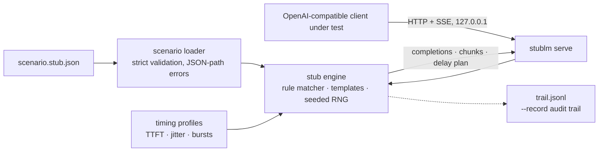

# stublm

[English](README.md) | [中文](README.zh.md) | [日本語](README.ja.md)

[](LICENSE)   [](CONTRIBUTING.md)

**开源的确定性 OpenAI 兼容 stub 服务器——用一个 JSON 文件定义脚本化回复、可播种的流式输出和逼真的 SSE 分块时序，让前端和 SDK 测试离线运行、无需密钥、每次逐字节一致。**


```bash
# not yet on npm — install from a checkout of this repository
npm install && npm run build && npm pack
npm install -g ./stublm-0.1.0.tgz
```

## 为什么选 stublm？

测试任何与 chat-completions API 对话的东西——流式 UI、SDK 重试循环、agent 框架——都需要管道另一端有个服务器，而每个真实端点都会带来 API 密钥、网络抖动、账单，以及每次运行都不同的回答。常见的变通方案各有缺口：手写 HTTP mock 只伪造 JSON，几乎从不伪造*流式输出*，SSE 渲染路径从未被测过；record/replay 磁带需要一个可用的付费 API 才能录制，回放分块时也没有真实的节奏；本地跑一个小型真实模型既慢又不确定，还是没人想要的 CI 依赖。stublm 走脚本化路线：一个 JSON 场景声明整个服务器——按最后一条 user 消息、模型或声明的工具匹配规则；脚本化 tool call（包括故意畸形的参数）；`times` 预算实现失败两次后恢复；时序 profile 塑造 TTFT、块间延迟、播种抖动和突发。同一场景、同一请求序列、同样的字节——而 `instant` profile 同步吐完整个流，CI 永远不用 sleep。

|  | stublm | 手写 mock（nock/msw） | record/replay 磁带 | 本地模型运行器 |
|---|---|---|---|---|
| Fixture 来源 | 声明式 JSON 场景 | JS 拦截器代码 | 抓取的真实流量 | 真实模型 |
| 带真实节奏的 SSE 流 | profile：TTFT、抖动、突发 | 几乎从不伪造 | 回放但没有时序 | 真实但不可控 |
| 跨运行确定性 | 每个 seed 逐字节一致 | 是（靠手工维护） | 是，但易过期 | 否 |
| 脚本化错误与重试序列 | JSON 里的 `times` + `error` 规则 | 每个测试手写 | 只有录到才有 | 无法脚本化 |
| 需要真实 API 或密钥 | 从不 | 否 | 是，录制时需要 | 否，但需要 GB 级权重 + GPU |
| 运行时体积 | Node，0 依赖 | 你的测试框架 + 库 | 代理 + 磁带存储 | 模型权重 + 运行时 |

<sub>能力对比核对自各方案的公开文档，2026-07。若要回放录制的 *agent 工具调用*，请看 agent-vcr——stublm 做的是脚本化的合成服务器行为。</sub>

## 特性

- **场景驱动，而非录制** —— 整个假服务器就是一个可 review 的 JSON 文件；`stublm validate` 在 CI 运行之前就用精确 JSON 路径拒绝笔误、死规则、坏正则和模板错误。
- **逐字节确定** —— 回复、id、embedding 乃至流抖动都由请求 seed（或内容哈希）派生；唯一的"时钟"是每会话调用计数器，排查 flaky 测试永远不会查到这里。
- **逼真的 SSE 时序 profile** —— `steady`、`typewriter`、`bursty` 以及自定义：TTFT、块间延迟、播种抖动、突发-停顿形态；内置 `instant` 同步吐流让测试永不 sleep，`--show-timing` 不用等待即可打印时序计划。
- **脚本化失败序列** —— `times` 预算加 `error` 载荷，五行 JSON 就能表达"先来一次带 `Retry-After: 1` 的 429，然后成功"：重试与退避逻辑终于有了试验台。
- **忠实流式的 tool call** —— 脚本化 `tool_calls` 以头部 + 参数分片 delta 的形式流出，和真实 API 一模一样；字符串参数原样透传，可以测试客户端面对畸形 JSON 的表现。
- **真实的 API 表面** —— `/v1/chat/completions`（JSON + SSE）、`/v1/models`、`/v1/embeddings`、`/healthz`、Bearer 认证、CORS、usage 统计、`max_tokens` 截断、`n` 个 choice；把任何 OpenAI 兼容 SDK 指向 `http://127.0.0.1:<port>/v1` 即可。
- **零运行时依赖，完全离线** —— 只需要 Node.js；stublm 只绑定 127.0.0.1，不向任何地方发送任何东西，`typescript` 是唯一的 devDependency。

## 快速上手

安装：

```bash
# not yet on npm — install from a checkout of this repository
npm install && npm run build && npm pack
npm install -g ./stublm-0.1.0.tgz
```

先看内置的客服机器人场景，再播放一段脚本化失败序列（真实捕获的运行结果）：

```bash
stublm inspect --scenario examples/support.stub.json
```

```text
support-stub v1.2.3 — 4 rule(s), 2 model(s), default profile "instant"
models: stub-large, stub-mini

#  LABEL            WHEN                                 TIMES  RESULT     PROFILE
0  refund-policy    lastUser has "refund"                -      text       -
1  escalation       lastUser /\b(manager|supervisor|h…/  -      text       -
2  rate-limit-once  lastUser has "flaky"                 1      error 429  -
3  watch-it-render  model=stub-mini, stream=true         -      text       slow-net

fallback: generate (2 sentence(s))
```

```bash
stublm reply --scenario examples/support.stub.json --message "this is flaky" --repeat 2
```

```text
{"status":429,"error":{"message":"Rate limit reached (scripted; the retry will succeed)","type":"rate_limit_error","param":null,"code":"rate_limit_exceeded"}}
The dataset organizes the remaining edge cases. Each component summarizes the remaining edge cases with minimal configuration.
```

现在通过 HTTP 启动它，像访问真服务一样访问（真实捕获的运行结果）：

```bash
stublm serve --scenario examples/support.stub.json --port 8437 --quiet &
curl -s http://127.0.0.1:8437/v1/chat/completions -H 'content-type: application/json' \
  -d '{"model":"stub-large","messages":[{"role":"user","content":"Can I get a refund?"}],"seed":7}'
```

```text
[stublm] serving "support-stub" v1.2.3 on http://127.0.0.1:8437 — 4 rule(s), 2 model(s), default profile "instant"
{"id":"chatcmpl-37a3176fd2e5713b6a2545af","object":"chat.completion","created":1735689600,"model":"stub-large","system_fingerprint":"fp_763f228f","choices":[{"index":0,"message":{"role":"assistant","content":"Refunds are processed within 5 business days. You asked: Can I get a refund?"},"logprobs":null,"finish_reason":"stop"}],"usage":{"prompt_tokens":13,"completion_tokens":22,"total_tokens":35}}
```

流式请求会按规则的时序 profile 输出 SSE 分块；加上 `x-stublm-profile: instant` 请求头即可把任何 profile 压缩为零延迟供 CI 使用。`stublm init` 会写出一份带注释的入门场景；更多见 [examples/](examples/README.md)。

## 场景文件

一个 JSON 文件声明整个服务器。规则按顺序尝试；第一条 `when` 匹配且 `times` 预算未耗尽的规则被采用。完整参考见 [docs/scenario-format.md](docs/scenario-format.md)。

| 规则键 | 默认 | 效果 |
|---|---|---|
| `when` | 全部匹配 | `model`（精确或 `stub-*` 通配）、`lastUser`/`system` 文本匹配器（`equals`/`contains`/`regex`）、`hasTool`、`stream` |
| `times` | 不限 | 最多服务 N 次然后穿透——序列与瞬时故障 |
| `reply` | — | 带 `{{message}}`/`{{call}}`/`{{seed}}` 模板的文本，和/或 `toolCalls`（字符串参数原样透传，畸形也照传） |
| `error` | — | `status`、`message`、`code`、`retryAfterSeconds` → 带 `Retry-After` 的真实 HTTP 错误 |
| `profile` | 场景默认值 | 该规则流式输出所用的时序 profile |

行为开关：`strictModels`（未知模型 404）、`clock: "fixed"`（冻结 `created` 保证逐字节一致）、`embeddingDims`、`cors`、`server.apiKey`（Bearer 认证）。未匹配的请求走 `fallback`：播种的 `generate` 文本、`echo`，或严格的 `reject` 404。

## `stublm` CLI

| 命令 | 作用 | 退出码 |
|---|---|---|
| `init [path]` | 写出带注释的入门场景 | 0，已存在则 2（`--force` 覆盖） |
| `validate --scenario f` | 离线检查场景，JSON 路径报错，死规则出警告 | 0 / 1 无效 / 2 不可读 |
| `inspect --scenario f` | 规则、模型、profile 的表格（`--format json`） | 0 |
| `reply --message t` | 进程内执行一次 chat 调用；`--stream`、`--show-timing`、`--seed`、`--repeat N` | 0，有回复出错则 1 |
| `serve --scenario f` | 127.0.0.1 上的 HTTP 服务器；`--port`（0 = 随机）、`--record f.jsonl`、`--quiet`（不打逐请求日志） | 0 |

## 架构



## 路线图

- [x] 场景驱动的 OpenAI 兼容 stub：匹配/序列/模板化回复、流式 tool call、播种时序 profile、embeddings、Bearer 认证、`--record`，以及 `init`/`validate`/`inspect`/`reply`/`serve` CLI（v0.1.0）
- [ ] 显式开启的混沌选项：流中途断连、截断 SSE 帧、永久停滞——用于超时路径测试
- [ ] `/v1/responses` 与旧版 `/v1/completions` 端点仿真
- [ ] 断言助手：`stublm verify trail.jsonl --expect expectations.json`
- [ ] 多轮对话脚本化（按 assistant 历史匹配规则）
- [ ] 发布到 npm

完整列表见 [open issues](https://github.com/JaydenCJ/stublm/issues)。

## 贡献

欢迎贡献。用 `npm install && npm run build` 构建，然后运行 `npm test`（89 个测试）和 `bash scripts/smoke.sh`（必须打印 `SMOKE OK`）——本仓库不带 CI，以上每一条声明都由本地运行验证。参见 [CONTRIBUTING.md](CONTRIBUTING.md)，认领一个 [good first issue](https://github.com/JaydenCJ/stublm/issues?q=is%3Aissue+is%3Aopen+label%3A%22good+first+issue%22)，或发起 [discussion](https://github.com/JaydenCJ/stublm/discussions)。

## 许可证

[MIT](LICENSE)
